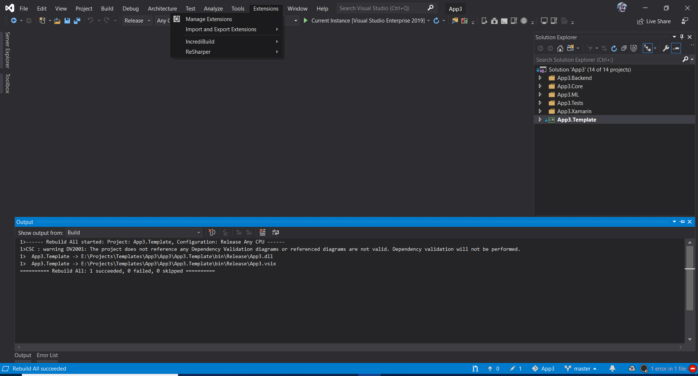
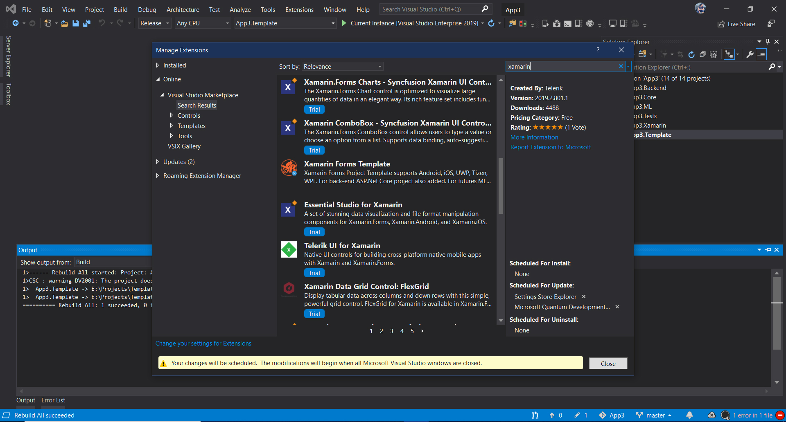
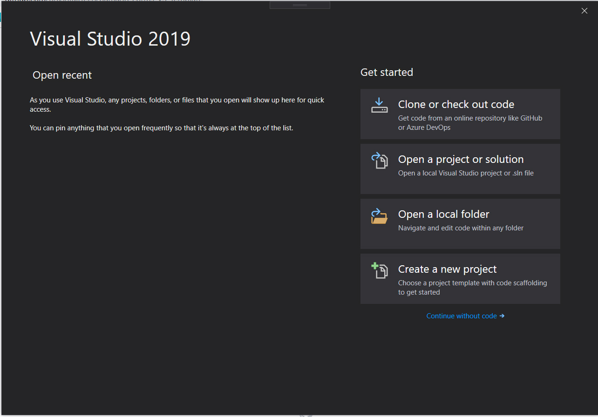
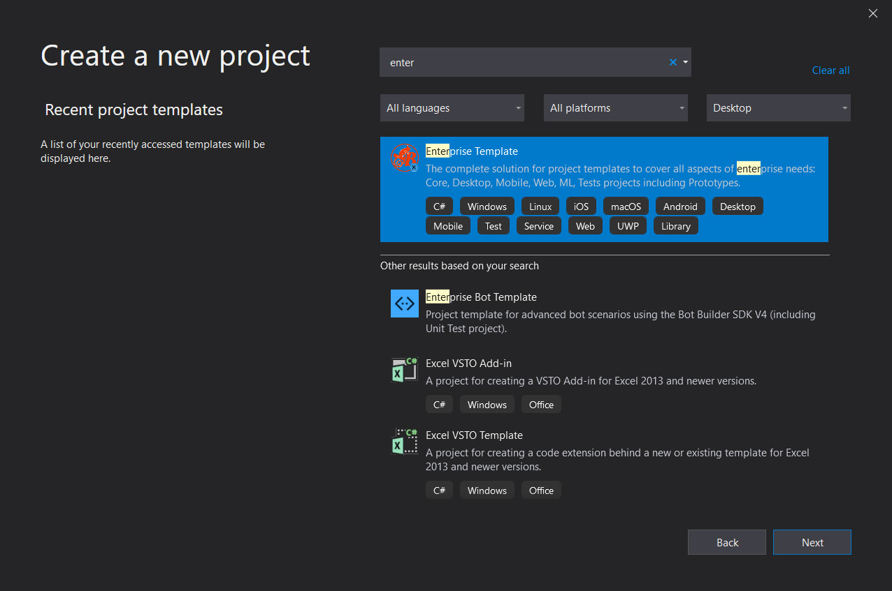
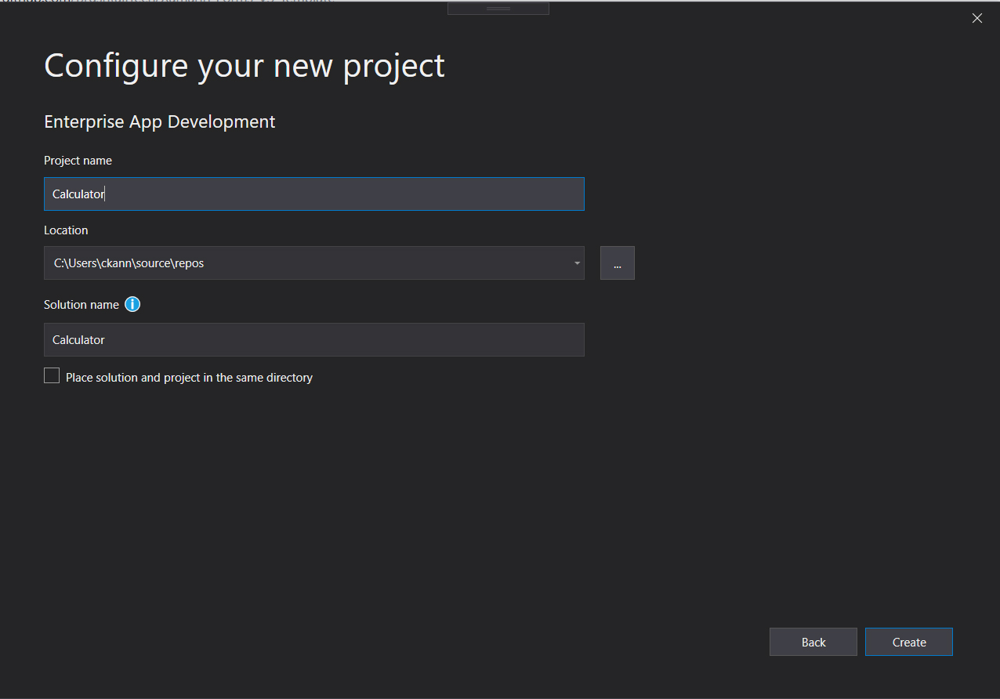
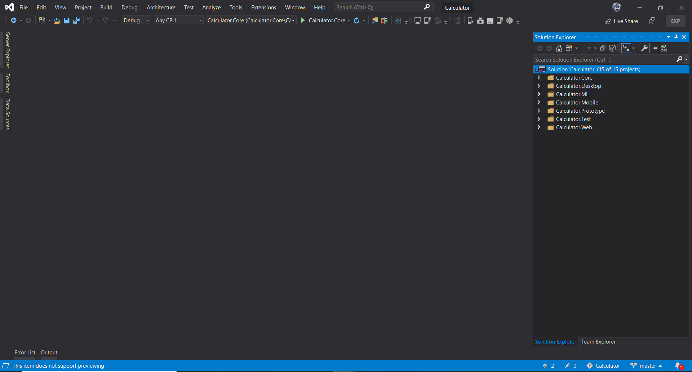
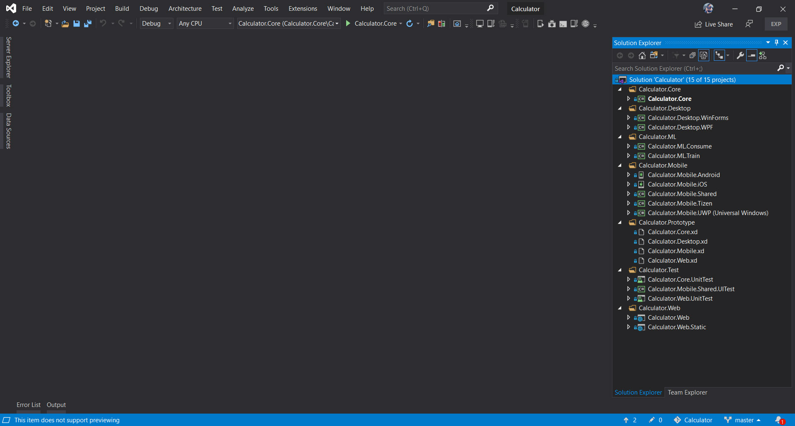

# Enterprise App Development Visual Studio Template

#### [Click to Join our discord](https://discord.gg/UX4UfCB) to improve the plugin, ask related to the bugs, support other developers. Be happy, make the surrounding also happy.

### Build Status

Azure Repos sync with Github - 

Marketplace Publish - 

# Getting Started

## 1. Overview

The xamarin.forms project template, that supports **Android, iOS, UWP, Tizen, WPF**. For backend, **ASP.NET Core** project is added. For testing, Xamarin Forms UI, backend testing project added. For next-generation, sample **machine learning** model generation and consume libraries are added. For feedback and ideas throw a mail to us. We are happy to collaborate with you.

## 2. Installing Plugin

#### Installing plugin from Marketplace click [here](https://marketplace.visualstudio.com/items?itemName=BrushtailTechnology.xamarinforms1).

#### Installing plugin from Visual Studio IDE

**Extensions->Manage Extensions**

**Click Online and Search for Xamarin or brushtail. Click Download->Close and restart the visual studio IDE.**

## 3. Creating an Enterprise Application

**Open Visual Studio click Create a New Project.**

**Search for an Enterprise App Development.**

**Type the project name.**

**Enterprise projects are created.**

## 4. Project Structure

**All projects types in the template.**

 

For example, the Enterprise app you are going create is Calculator. Following project structure explanation:  

**Calculator.Core** -> .Net standard project for app domain functionality.  
<em><b>Place Data layer or logic inside Calculator.Core Solution Folder.</b></em>

**Calculator.Desktop.WinForms** -> .Net Core project for Desktop WinForm Project.  
**Calculator.Desktop.WPF** -> .Net Core project for Desktop WPF Project. If you want Xamarin Forms link to WPF.  

**Calculator.MLConsume** -> .Net core project for consuming ML.Net.  
**Calculator.MLTrain** -> .Net core project for training ML.Net model.  

**Calculator.Mobile.Shared** -> Project for Xamarin forms shared logic and UI.  
**Calculator.Mobile.Android** -> Project for Xamarin forms android app.  
**Calculator.Mobile.iOS** -> Project for Xamarin forms iOS app.  
**Calculator.Mobile.UWP** -> Project for Xamarin forms UWP app.  
**Calculator.Mobile.Tizen** -> Project for Xamarin forms Tizen app.  
**Calculator.Mobile.WPF** -> Project for Xamarin forms WPF app.  

**Calculator.Core.UnitTest** -> .Net core xunit project for testing domain functionality.  
**Calculator.Web.UnitTest** -> .Net core xunit project for testing Web app functionality.  
**Calculator.Mobile.Shared.UITest** -> Project for testing Xamarin forms UI.  

**Calculator.Web** -> ASP.Net Core project for Web app and backend API.  
**Calculator.Web.Static** -> ASP.Net Core project for static Web app for User interface design.  

# 5. Adobe XD Files

**Calculator.Core.xd** -> Adobe XD file for application architecture design, Models or related works.  
**Calculator.Desktop.xd** -> Adobe XD file for Desktop UI prototype.  
**Calculator.Mobile.xd** -> Adobe XD file for Mobile UI prototype.  
**Calculator.Web.xd** -> Adobe XD file for Mobile UI prototype.  
**Calculator.UIKit.xd** -> Adobe XD file for creating UIKit for fonts, themes, controls, UI interactions.  

<em>I was created Open with Adobe XD extension to Open Adobe XD files inside Visual Studio. So no need to switch Visual Studio back and forth. Click [here](https://marketplace.visualstudio.com/items?itemName=BrushtailTechnology.OpenWithAdobeXD) to install. </em>

# 6. Support Us

**Give good review and rating** click [here](https://marketplace.visualstudio.com/items?itemName=BrushtailTechnology.xamarinforms1&ssr=false#review-details)

**Ask any question related to this plugin** click [here](https://marketplace.visualstudio.com/items?itemName=BrushtailTechnology.xamarinforms1&ssr=false#qna)

**If you support us by donating, we are stick with our dreams and give back to you good products.**

### Thanks
